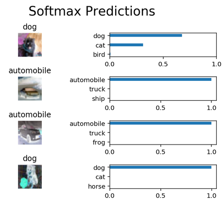

# Image Classification using the CIFAR-10 dataset
In this project I'm experimenting with Image Classification of the CIFAR-10 dataset using Machine Learning. The objective is to be able to train a neural network to be able to identify pictures of airplanes, dogs, and cats amongst other things. 

This project is referenced from [https://github.com/deep-diver/CIFAR10-img-classification-tensorflow](https://github.com/deep-diver/CIFAR10-img-classification-tensorflow), with modifications.

To demo this project, make sure your enviroment has Python3 as well as the neccessarry libraries, such as tensorflow, tqdm, etc...
Then, if you are using mac, make sure to use Python3 by doing
```
python3 CIFAR10_image_classification.py
```

The python scipt should then run, first downloading the CIFAR-10 dataset from an online URL into your local repo. Next, it will evaluate the dataset and print out informative statistics about it. Lastly, it will pre-process and load the data in order to train the neural network.

This is the loss reduction and accuracy statistics when training the models.


In the end, the neural network should be able to classify images with an accuracy of over 50%. Examples are shown below.


